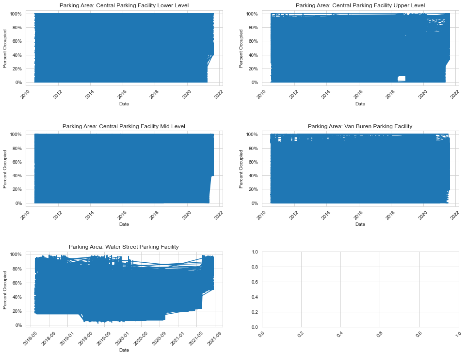
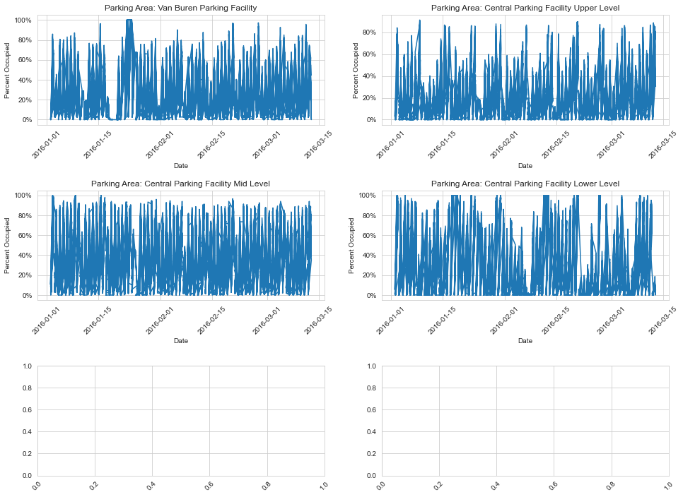
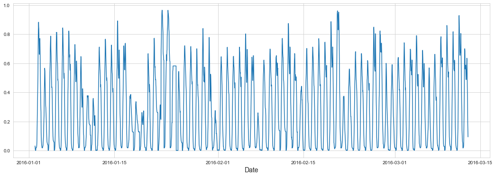
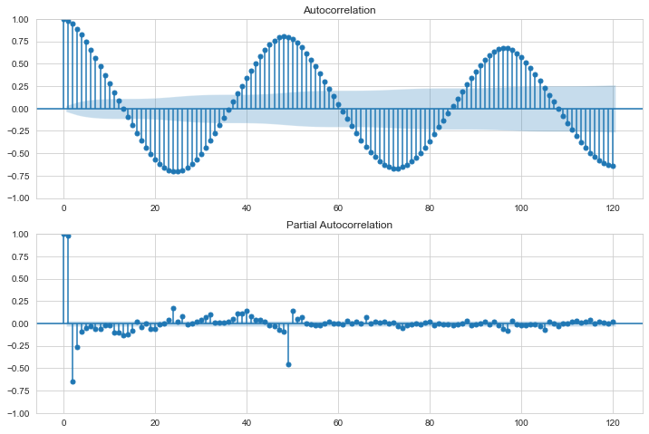
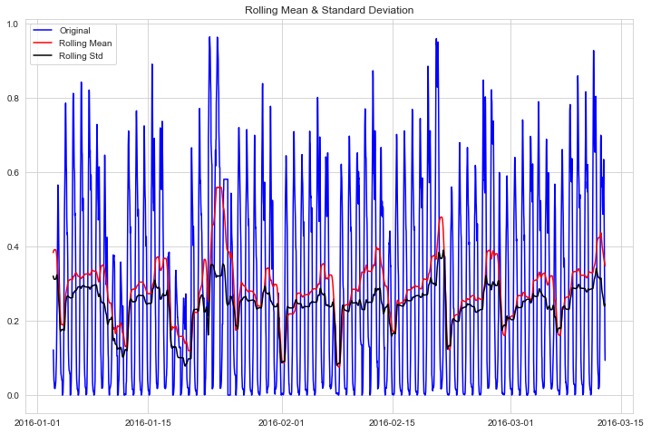
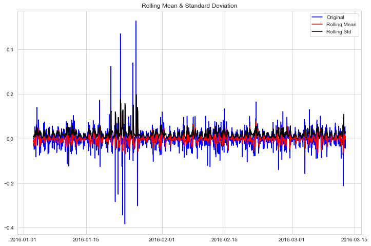
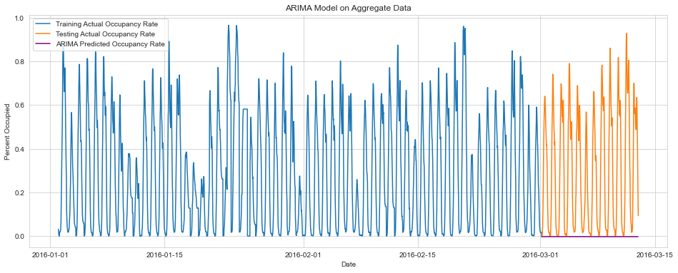
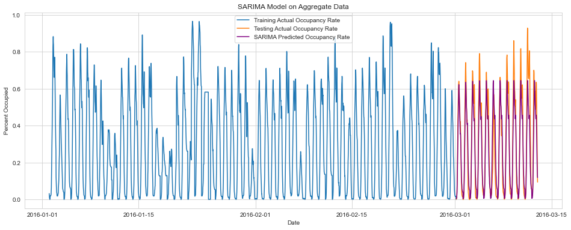

# Predicting Parking Occupancy Rates in Naperville, IL

An obvious question for an individual driver may be: when and where will parking be available?

In order to predict an answer to this question, we will make a predictive model using Time Series analysis.

Specifically, we will try two models:
+ ARIMA (Autoregressive integrated moving average)
+ SARIMA (Seasonal ARIMA).

The dataset includes parking area occupancy and capacity for various locations in Naperville, IL.

Each observation includes a date and time, ranging from Jan 1, 2010 through 2021 and for all times.  The measurements were taken every half hour, but not at exactly 0:00 and 0:30 times.


```python
import pandas as pd
pd.set_option('display.max_columns', 500)

import numpy as np

import matplotlib.pyplot as plt
get_ipython().run_line_magic('matplotlib', 'inline')

import matplotlib.ticker as ticker

import seaborn as sns
sns.set_style('whitegrid')

from statsmodels.tsa.stattools import adfuller, acf, pacf
from statsmodels.graphics.tsaplots import plot_acf, plot_pacf


from statsmodels.tsa.statespace.sarimax import SARIMAX
from statsmodels.tsa.arima.model import ARIMA
from statsmodels.tsa.seasonal import seasonal_decompose
from pandas.plotting import autocorrelation_plot

from sklearn import metrics

from sklearn.linear_model import LinearRegression

import warnings

import datetime
from datetime import timedelta 
```


```python
df_raw = pd.read_excel(r'/Users/aditya.manthri/mlpark/large_data_set_Parking Occupancy.xlsx')
df_raw.dtypes
```


    TimeStamp         datetime64[ns]
    Facility                  object
    Occupied                   int64
    Address                   object
    Vacant                     int64
    TotalAvailable             int64
    dtype: object


```python
df_raw.head(10)
```


<div>
<style scoped>
    .dataframe tbody tr th:only-of-type {
        vertical-align: middle;
    }

    .dataframe tbody tr th {
        vertical-align: top;
    }

    .dataframe thead th {
        text-align: right;
    }
</style>
<table border="1" class="dataframe">
  <thead>
    <tr style="text-align: right;">
      <th></th>
      <th>TimeStamp</th>
      <th>Facility</th>
      <th>Occupied</th>
      <th>Address</th>
      <th>Vacant</th>
      <th>TotalAvailable</th>
    </tr>
  </thead>
  <tbody>
    <tr>
      <th>0</th>
      <td>2018-05-30 04:42:00</td>
      <td>Central Parking Facility Lower Level</td>
      <td>0</td>
      <td>75 E Chicago Av, Naperville IL</td>
      <td>166</td>
      <td>166</td>
    </tr>
    <tr>
      <th>1</th>
      <td>2018-12-20 04:12:00</td>
      <td>Central Parking Facility Lower Level</td>
      <td>0</td>
      <td>75 E Chicago Av, Naperville IL</td>
      <td>166</td>
      <td>166</td>
    </tr>
    <tr>
      <th>2</th>
      <td>2018-12-20 04:42:00</td>
      <td>Central Parking Facility Lower Level</td>
      <td>0</td>
      <td>75 E Chicago Av, Naperville IL</td>
      <td>166</td>
      <td>166</td>
    </tr>
    <tr>
      <th>3</th>
      <td>2018-12-06 04:12:00</td>
      <td>Central Parking Facility Lower Level</td>
      <td>0</td>
      <td>75 E Chicago Av, Naperville IL</td>
      <td>166</td>
      <td>166</td>
    </tr>
    <tr>
      <th>4</th>
      <td>2019-12-19 04:42:00</td>
      <td>Central Parking Facility Lower Level</td>
      <td>0</td>
      <td>75 E Chicago Av, Naperville IL</td>
      <td>166</td>
      <td>166</td>
    </tr>
    <tr>
      <th>5</th>
      <td>2018-12-13 04:42:00</td>
      <td>Central Parking Facility Lower Level</td>
      <td>0</td>
      <td>75 E Chicago Av, Naperville IL</td>
      <td>166</td>
      <td>166</td>
    </tr>
    <tr>
      <th>6</th>
      <td>2018-12-13 04:12:00</td>
      <td>Central Parking Facility Lower Level</td>
      <td>0</td>
      <td>75 E Chicago Av, Naperville IL</td>
      <td>166</td>
      <td>166</td>
    </tr>
    <tr>
      <th>7</th>
      <td>2018-12-06 04:42:00</td>
      <td>Central Parking Facility Lower Level</td>
      <td>0</td>
      <td>75 E Chicago Av, Naperville IL</td>
      <td>166</td>
      <td>166</td>
    </tr>
    <tr>
      <th>8</th>
      <td>2019-12-19 04:12:00</td>
      <td>Central Parking Facility Lower Level</td>
      <td>0</td>
      <td>75 E Chicago Av, Naperville IL</td>
      <td>166</td>
      <td>166</td>
    </tr>
    <tr>
      <th>9</th>
      <td>2019-12-26 04:42:00</td>
      <td>Central Parking Facility Lower Level</td>
      <td>0</td>
      <td>75 E Chicago Av, Naperville IL</td>
      <td>166</td>
      <td>166</td>
    </tr>
  </tbody>
</table>
</div>


```python
len(df_raw)
```


    827375


```python
df_clean = df_raw.copy()
df_clean.TimeStamp = df_clean.TimeStamp.astype('datetime64')
df_clean['PercentOccupied'] = df_clean.Occupied / df_clean.TotalAvailable
df_clean['date'] = df_clean.TimeStamp.dt.date
df_clean['dayofweek'] = df_clean.TimeStamp.dt.dayofweek
df_clean['date_time_halfhour'] = df_clean.TimeStamp.dt.round('30min')
df_clean['time'] = df_clean.date_time_halfhour.dt.time
```


```python
df_clean.head()
```


<div>
<style scoped>
    .dataframe tbody tr th:only-of-type {
        vertical-align: middle;
    }

    .dataframe tbody tr th {
        vertical-align: top;
    }

    .dataframe thead th {
        text-align: right;
    }
</style>
<table border="1" class="dataframe">
  <thead>
    <tr style="text-align: right;">
      <th></th>
      <th>TimeStamp</th>
      <th>Facility</th>
      <th>Occupied</th>
      <th>Address</th>
      <th>Vacant</th>
      <th>TotalAvailable</th>
      <th>PercentOccupied</th>
      <th>date</th>
      <th>dayofweek</th>
      <th>date_time_halfhour</th>
      <th>time</th>
    </tr>
  </thead>
  <tbody>
    <tr>
      <th>0</th>
      <td>2018-05-30 04:42:00</td>
      <td>Central Parking Facility Lower Level</td>
      <td>0</td>
      <td>75 E Chicago Av, Naperville IL</td>
      <td>166</td>
      <td>166</td>
      <td>0.0</td>
      <td>2018-05-30</td>
      <td>2</td>
      <td>2018-05-30 04:30:00</td>
      <td>04:30:00</td>
    </tr>
    <tr>
      <th>1</th>
      <td>2018-12-20 04:12:00</td>
      <td>Central Parking Facility Lower Level</td>
      <td>0</td>
      <td>75 E Chicago Av, Naperville IL</td>
      <td>166</td>
      <td>166</td>
      <td>0.0</td>
      <td>2018-12-20</td>
      <td>3</td>
      <td>2018-12-20 04:00:00</td>
      <td>04:00:00</td>
    </tr>
    <tr>
      <th>2</th>
      <td>2018-12-20 04:42:00</td>
      <td>Central Parking Facility Lower Level</td>
      <td>0</td>
      <td>75 E Chicago Av, Naperville IL</td>
      <td>166</td>
      <td>166</td>
      <td>0.0</td>
      <td>2018-12-20</td>
      <td>3</td>
      <td>2018-12-20 04:30:00</td>
      <td>04:30:00</td>
    </tr>
    <tr>
      <th>3</th>
      <td>2018-12-06 04:12:00</td>
      <td>Central Parking Facility Lower Level</td>
      <td>0</td>
      <td>75 E Chicago Av, Naperville IL</td>
      <td>166</td>
      <td>166</td>
      <td>0.0</td>
      <td>2018-12-06</td>
      <td>3</td>
      <td>2018-12-06 04:00:00</td>
      <td>04:00:00</td>
    </tr>
    <tr>
      <th>4</th>
      <td>2019-12-19 04:42:00</td>
      <td>Central Parking Facility Lower Level</td>
      <td>0</td>
      <td>75 E Chicago Av, Naperville IL</td>
      <td>166</td>
      <td>166</td>
      <td>0.0</td>
      <td>2019-12-19</td>
      <td>3</td>
      <td>2019-12-19 04:30:00</td>
      <td>04:30:00</td>
    </tr>
  </tbody>
</table>
</div>


```python
df_clean.groupby('time').size()
```


    time
    00:00:00    17682
    00:30:00    16891
    01:00:00    17677
    01:30:00    16872
    02:00:00    17584
    02:30:00    16828
    03:00:00    17171
    03:30:00    16826
    04:00:00    17569
    04:30:00    16834
    05:00:00    17504
    05:30:00    16915
    06:00:00    17592
    06:30:00    16818
    07:00:00    17517
    07:30:00    16924
    08:00:00    17631
    08:30:00    16839
    09:00:00    17620
    09:30:00    16839
    10:00:00    17649
    10:30:00    16812
    11:00:00    17667
    11:30:00    16850
    12:00:00    17632
    12:30:00    16851
    13:00:00    17653
    13:30:00    16860
    14:00:00    17664
    14:30:00    16855
    15:00:00    17647
    15:30:00    16835
    16:00:00    17648
    16:30:00    16882
    17:00:00    17643
    17:30:00    16892
    18:00:00    17648
    18:30:00    16893
    19:00:00    17619
    19:30:00    16911
    20:00:00    17631
    20:30:00    16897
    21:00:00    17639
    21:30:00    16902
    22:00:00    17650
    22:30:00    16887
    23:00:00    17656
    23:30:00    16869
    dtype: int64


```python
pre_len = len(df_clean)
df_clean = df_clean.drop_duplicates()

post_len = len(df_clean)

dropped_len = pre_len - post_len
print(dropped_len)
```

    0


```python
# Note that some values are out of range of 0-100%
print('Minimum Percent Occupied: {:.2%}'.format(df_clean.PercentOccupied.min()))
print('Maximum Percent Occupied: {:.2%}'.format(df_clean.PercentOccupied.max()))
```

    Minimum Percent Occupied: 0.00%
    Maximum Percent Occupied: 42509.04%


```python
df_clean.Occupied = df_clean.apply(lambda x: max(0, min(x['TotalAvailable'], x['Occupied'])), axis=1)
df_clean['PercentOccupied'] = df_clean.Occupied / df_clean.TotalAvailable
```


```python
# Re-check range
print('Minimum Percent Occupied: {:.2%}'.format(df_clean.PercentOccupied.min()))
print('Maximum Percent Occupied: {:.2%}'.format(df_clean.PercentOccupied.max()))
```

    Minimum Percent Occupied: 0.00%
    Maximum Percent Occupied: 100.00%


```python
def sample_plots_by_scn(df, num_graphs, num_per_row, fig_width=16, hspace=0.6):
    """Print a sample of the data by Parking location, identified with the field SystemCodeNumber
    Parameters:
    num_graphs: Number of locations to make graphs for, ordered by appearance in the dataset.
    
    num_per_row: Number of columns in subplot.
    
    fig_width: Used to adjust the width of the subplots figure.  (default=16)
    
    hspace: Used to adjust whitespace between each row of subplots. (default=0.6)"""
    num_rows = int(np.ceil(num_graphs/num_per_row))
    fig, axes = plt.subplots(nrows=num_rows, ncols=num_per_row, figsize=(fig_width, num_rows * fig_width/4))
    fig.subplots_adjust(hspace=hspace)
    plt.xticks(rotation=45)
    for i, scn in enumerate(df.Facility.unique()[:num_graphs]):
        temp_df = df[df.Facility==scn]
        ax = axes[i//num_per_row, i%num_per_row]
        ax.plot(temp_df.TimeStamp, temp_df.PercentOccupied)
        ax.set_title('Parking Area: {}'.format(scn))
        ax.set_xlabel('Date')
        ax.set_ylabel('Percent Occupied')
        ax.yaxis.set_major_formatter(ticker.PercentFormatter(xmax=1));
        
    for ax in fig.axes:
        plt.sca(ax)
        plt.xticks(rotation=45)
sample_plots_by_scn(df=df_clean, num_graphs=5, num_per_row=2)
```


    

    


```python
df_agg_dthh = df_clean.groupby('date_time_halfhour').agg({'Occupied':['sum','count'], 'TotalAvailable':['sum','count']})
df_agg_dthh['PercentOccupied'] = df_agg_dthh.Occupied['sum'] / df_agg_dthh.TotalAvailable['sum']
```


```python
df_agg_dthh[(df_agg_dthh.Occupied['count']<20)|(df_agg_dthh.TotalAvailable['sum']<25000)]
```


<div>
<style scoped>
    .dataframe tbody tr th:only-of-type {
        vertical-align: middle;
    }

    .dataframe tbody tr th {
        vertical-align: top;
    }

    .dataframe thead tr th {
        text-align: left;
    }

    .dataframe thead tr:last-of-type th {
        text-align: right;
    }
</style>
<table border="1" class="dataframe">
  <thead>
    <tr>
      <th></th>
      <th colspan="2" halign="left">Occupied</th>
      <th colspan="2" halign="left">TotalAvailable</th>
      <th>PercentOccupied</th>
    </tr>
    <tr>
      <th></th>
      <th>sum</th>
      <th>count</th>
      <th>sum</th>
      <th>count</th>
      <th></th>
    </tr>
    <tr>
      <th>date_time_halfhour</th>
      <th></th>
      <th></th>
      <th></th>
      <th></th>
      <th></th>
    </tr>
  </thead>
  <tbody>
    <tr>
      <th>2010-07-19 18:00:00</th>
      <td>0</td>
      <td>4</td>
      <td>1306</td>
      <td>4</td>
      <td>0.000000</td>
    </tr>
    <tr>
      <th>2010-07-20 07:30:00</th>
      <td>0</td>
      <td>4</td>
      <td>1306</td>
      <td>4</td>
      <td>0.000000</td>
    </tr>
    <tr>
      <th>2010-07-20 08:00:00</th>
      <td>33</td>
      <td>4</td>
      <td>1306</td>
      <td>4</td>
      <td>0.025268</td>
    </tr>
    <tr>
      <th>2010-07-20 08:30:00</th>
      <td>72</td>
      <td>4</td>
      <td>1306</td>
      <td>4</td>
      <td>0.055130</td>
    </tr>
    <tr>
      <th>2010-07-20 09:00:00</th>
      <td>116</td>
      <td>4</td>
      <td>1306</td>
      <td>4</td>
      <td>0.088821</td>
    </tr>
    <tr>
      <th>...</th>
      <td>...</td>
      <td>...</td>
      <td>...</td>
      <td>...</td>
      <td>...</td>
    </tr>
    <tr>
      <th>2021-08-23 06:30:00</th>
      <td>582</td>
      <td>5</td>
      <td>1688</td>
      <td>5</td>
      <td>0.344787</td>
    </tr>
    <tr>
      <th>2021-08-23 07:00:00</th>
      <td>612</td>
      <td>5</td>
      <td>1688</td>
      <td>5</td>
      <td>0.362559</td>
    </tr>
    <tr>
      <th>2021-08-23 07:30:00</th>
      <td>663</td>
      <td>5</td>
      <td>1688</td>
      <td>5</td>
      <td>0.392773</td>
    </tr>
    <tr>
      <th>2021-08-23 08:00:00</th>
      <td>732</td>
      <td>5</td>
      <td>1688</td>
      <td>5</td>
      <td>0.433649</td>
    </tr>
    <tr>
      <th>2021-08-23 08:30:00</th>
      <td>796</td>
      <td>5</td>
      <td>1688</td>
      <td>5</td>
      <td>0.471564</td>
    </tr>
  </tbody>
</table>
<p>190241 rows × 5 columns</p>
</div>


```python
df_agg_dthh.head()
```


<div>
<style scoped>
    .dataframe tbody tr th:only-of-type {
        vertical-align: middle;
    }

    .dataframe tbody tr th {
        vertical-align: top;
    }

    .dataframe thead tr th {
        text-align: left;
    }

    .dataframe thead tr:last-of-type th {
        text-align: right;
    }
</style>
<table border="1" class="dataframe">
  <thead>
    <tr>
      <th></th>
      <th colspan="2" halign="left">Occupied</th>
      <th colspan="2" halign="left">TotalAvailable</th>
      <th>PercentOccupied</th>
    </tr>
    <tr>
      <th></th>
      <th>sum</th>
      <th>count</th>
      <th>sum</th>
      <th>count</th>
      <th></th>
    </tr>
    <tr>
      <th>date_time_halfhour</th>
      <th></th>
      <th></th>
      <th></th>
      <th></th>
      <th></th>
    </tr>
  </thead>
  <tbody>
    <tr>
      <th>2010-07-19 18:00:00</th>
      <td>0</td>
      <td>4</td>
      <td>1306</td>
      <td>4</td>
      <td>0.000000</td>
    </tr>
    <tr>
      <th>2010-07-20 07:30:00</th>
      <td>0</td>
      <td>4</td>
      <td>1306</td>
      <td>4</td>
      <td>0.000000</td>
    </tr>
    <tr>
      <th>2010-07-20 08:00:00</th>
      <td>33</td>
      <td>4</td>
      <td>1306</td>
      <td>4</td>
      <td>0.025268</td>
    </tr>
    <tr>
      <th>2010-07-20 08:30:00</th>
      <td>72</td>
      <td>4</td>
      <td>1306</td>
      <td>4</td>
      <td>0.055130</td>
    </tr>
    <tr>
      <th>2010-07-20 09:00:00</th>
      <td>116</td>
      <td>4</td>
      <td>1306</td>
      <td>4</td>
      <td>0.088821</td>
    </tr>
  </tbody>
</table>
</div>


```python
temp = df_agg_dthh.reset_index()
temp['date'] = temp.date_time_halfhour.dt.date
temp['time'] = temp.date_time_halfhour.dt.time
temp = temp.groupby('date').count()
temp = pd.DataFrame(temp, index=pd.date_range('2016-01-01', '2016-03-12')).fillna(0)
temp[temp.date_time_halfhour<48]
```

    /Users/aditya.manthri/opt/anaconda3/lib/python3.8/site-packages/pandas/core/generic.py:4153: PerformanceWarning: dropping on a non-lexsorted multi-index without a level parameter may impact performance.
      obj = obj._drop_axis(labels, axis, level=level, errors=errors)


<div>
<style scoped>
    .dataframe tbody tr th:only-of-type {
        vertical-align: middle;
    }

    .dataframe tbody tr th {
        vertical-align: top;
    }

    .dataframe thead tr th {
        text-align: left;
    }
</style>
<table border="1" class="dataframe">
  <thead>
    <tr>
      <th></th>
      <th>date_time_halfhour</th>
      <th colspan="2" halign="left">Occupied</th>
      <th colspan="2" halign="left">TotalAvailable</th>
      <th>PercentOccupied</th>
      <th>time</th>
    </tr>
    <tr>
      <th></th>
      <th></th>
      <th>sum</th>
      <th>count</th>
      <th>sum</th>
      <th>count</th>
      <th></th>
      <th></th>
    </tr>
  </thead>
  <tbody>
  </tbody>
</table>
</div>


```python
df_agg_fillmissing = df_agg_dthh.copy()
df_agg_fillmissing.sort_index(inplace=True)
```


```python
temp = pd.Series(df_agg_fillmissing.index.date).value_counts()
temp[temp<48]
```


    2021-05-20    47
    2021-02-08    47
    2016-10-07    47
    2021-01-25    47
    2020-11-09    47
                  ..
    2013-04-21     7
    2020-12-17     4
    2017-05-03     4
    2017-04-29     2
    2010-07-19     1
    Length: 399, dtype: int64


```python
df_clean.head()

```


<div>
<style scoped>
    .dataframe tbody tr th:only-of-type {
        vertical-align: middle;
    }

    .dataframe tbody tr th {
        vertical-align: top;
    }

    .dataframe thead th {
        text-align: right;
    }
</style>
<table border="1" class="dataframe">
  <thead>
    <tr style="text-align: right;">
      <th></th>
      <th>TimeStamp</th>
      <th>Facility</th>
      <th>Occupied</th>
      <th>Address</th>
      <th>Vacant</th>
      <th>TotalAvailable</th>
      <th>PercentOccupied</th>
      <th>date</th>
      <th>dayofweek</th>
      <th>date_time_halfhour</th>
      <th>time</th>
    </tr>
  </thead>
  <tbody>
    <tr>
      <th>0</th>
      <td>2018-05-30 04:42:00</td>
      <td>Central Parking Facility Lower Level</td>
      <td>0</td>
      <td>75 E Chicago Av, Naperville IL</td>
      <td>166</td>
      <td>166</td>
      <td>0.0</td>
      <td>2018-05-30</td>
      <td>2</td>
      <td>2018-05-30 04:30:00</td>
      <td>04:30:00</td>
    </tr>
    <tr>
      <th>1</th>
      <td>2018-12-20 04:12:00</td>
      <td>Central Parking Facility Lower Level</td>
      <td>0</td>
      <td>75 E Chicago Av, Naperville IL</td>
      <td>166</td>
      <td>166</td>
      <td>0.0</td>
      <td>2018-12-20</td>
      <td>3</td>
      <td>2018-12-20 04:00:00</td>
      <td>04:00:00</td>
    </tr>
    <tr>
      <th>2</th>
      <td>2018-12-20 04:42:00</td>
      <td>Central Parking Facility Lower Level</td>
      <td>0</td>
      <td>75 E Chicago Av, Naperville IL</td>
      <td>166</td>
      <td>166</td>
      <td>0.0</td>
      <td>2018-12-20</td>
      <td>3</td>
      <td>2018-12-20 04:30:00</td>
      <td>04:30:00</td>
    </tr>
    <tr>
      <th>3</th>
      <td>2018-12-06 04:12:00</td>
      <td>Central Parking Facility Lower Level</td>
      <td>0</td>
      <td>75 E Chicago Av, Naperville IL</td>
      <td>166</td>
      <td>166</td>
      <td>0.0</td>
      <td>2018-12-06</td>
      <td>3</td>
      <td>2018-12-06 04:00:00</td>
      <td>04:00:00</td>
    </tr>
    <tr>
      <th>4</th>
      <td>2019-12-19 04:42:00</td>
      <td>Central Parking Facility Lower Level</td>
      <td>0</td>
      <td>75 E Chicago Av, Naperville IL</td>
      <td>166</td>
      <td>166</td>
      <td>0.0</td>
      <td>2019-12-19</td>
      <td>3</td>
      <td>2019-12-19 04:30:00</td>
      <td>04:30:00</td>
    </tr>
  </tbody>
</table>
</div>


```python
df_clean['date'] = pd.to_datetime(df_clean['date'])
```


```python
df = df_clean.sort_values(by='date')
```


```python
start_date = '2016-01-01'
end_date = '2016-03-12'
mask = (df['date'] > start_date) & (df['date'] <= end_date)
```


```python
df = df.loc[mask]
df.head()
```


<div>
<style scoped>
    .dataframe tbody tr th:only-of-type {
        vertical-align: middle;
    }

    .dataframe tbody tr th {
        vertical-align: top;
    }

    .dataframe thead th {
        text-align: right;
    }
</style>
<table border="1" class="dataframe">
  <thead>
    <tr style="text-align: right;">
      <th></th>
      <th>TimeStamp</th>
      <th>Facility</th>
      <th>Occupied</th>
      <th>Address</th>
      <th>Vacant</th>
      <th>TotalAvailable</th>
      <th>PercentOccupied</th>
      <th>date</th>
      <th>dayofweek</th>
      <th>date_time_halfhour</th>
      <th>time</th>
    </tr>
  </thead>
  <tbody>
    <tr>
      <th>753599</th>
      <td>2016-01-02 04:04:00</td>
      <td>Van Buren Parking Facility</td>
      <td>20</td>
      <td>43 W Van Buren Av, Naperville IL</td>
      <td>772</td>
      <td>792</td>
      <td>0.025253</td>
      <td>2016-01-02</td>
      <td>5</td>
      <td>2016-01-02 04:00:00</td>
      <td>04:00:00</td>
    </tr>
    <tr>
      <th>766493</th>
      <td>2016-01-02 02:34:00</td>
      <td>Van Buren Parking Facility</td>
      <td>0</td>
      <td>43 W Van Buren Av, Naperville IL</td>
      <td>792</td>
      <td>792</td>
      <td>0.000000</td>
      <td>2016-01-02</td>
      <td>5</td>
      <td>2016-01-02 02:30:00</td>
      <td>02:30:00</td>
    </tr>
    <tr>
      <th>48868</th>
      <td>2016-01-02 05:04:00</td>
      <td>Central Parking Facility Upper Level</td>
      <td>0</td>
      <td>75 E Chicago Av, Naperville IL</td>
      <td>197</td>
      <td>197</td>
      <td>0.000000</td>
      <td>2016-01-02</td>
      <td>5</td>
      <td>2016-01-02 05:00:00</td>
      <td>05:00:00</td>
    </tr>
    <tr>
      <th>48869</th>
      <td>2016-01-02 05:34:00</td>
      <td>Central Parking Facility Upper Level</td>
      <td>0</td>
      <td>75 E Chicago Av, Naperville IL</td>
      <td>197</td>
      <td>197</td>
      <td>0.000000</td>
      <td>2016-01-02</td>
      <td>5</td>
      <td>2016-01-02 05:30:00</td>
      <td>05:30:00</td>
    </tr>
    <tr>
      <th>523575</th>
      <td>2016-01-02 22:04:00</td>
      <td>Central Parking Facility Mid Level</td>
      <td>102</td>
      <td>75 E Chicago Av, Naperville IL</td>
      <td>49</td>
      <td>151</td>
      <td>0.675497</td>
      <td>2016-01-02</td>
      <td>5</td>
      <td>2016-01-02 22:00:00</td>
      <td>22:00:00</td>
    </tr>
  </tbody>
</table>
</div>


```python
sample_plots_by_scn(df=df, num_graphs=5, num_per_row=2)
```


    

    


```python
df_agg_dthh_updated = df.groupby('date_time_halfhour').agg({'Occupied':['sum','count'], 'TotalAvailable':['sum','count']})
df_agg_dthh_updated['PercentOccupied'] = df_agg_dthh_updated.Occupied['sum'] / df_agg_dthh_updated.TotalAvailable['sum']
```


```python
df_agg_dthh_updated.drop(columns=['Occupied', 'TotalAvailable'], inplace=True)
```


```python
df_agg_fillmissing = df_agg_dthh_updated.copy()
df_agg_fillmissing.sort_index(inplace=True)
df_agg_fillmissing.head()
```


<div>
<style scoped>
    .dataframe tbody tr th:only-of-type {
        vertical-align: middle;
    }

    .dataframe tbody tr th {
        vertical-align: top;
    }

    .dataframe thead tr th {
        text-align: left;
    }

    .dataframe thead tr:last-of-type th {
        text-align: right;
    }
</style>
<table border="1" class="dataframe">
  <thead>
    <tr>
      <th></th>
      <th>PercentOccupied</th>
    </tr>
    <tr>
      <th></th>
      <th></th>
    </tr>
    <tr>
      <th>date_time_halfhour</th>
      <th></th>
    </tr>
  </thead>
  <tbody>
    <tr>
      <th>2016-01-02 00:00:00</th>
      <td>0.031394</td>
    </tr>
    <tr>
      <th>2016-01-02 00:30:00</th>
      <td>0.016845</td>
    </tr>
    <tr>
      <th>2016-01-02 01:00:00</th>
      <td>0.006891</td>
    </tr>
    <tr>
      <th>2016-01-02 01:30:00</th>
      <td>0.004594</td>
    </tr>
    <tr>
      <th>2016-01-02 02:00:00</th>
      <td>0.000000</td>
    </tr>
  </tbody>
</table>
</div>


```python
temp = pd.Series(df_agg_fillmissing.index.date).value_counts()
temp[temp<48]
```


    Series([], dtype: int64)


```python
plt.figure(figsize=(18,6))
plt.plot(df_agg_fillmissing)
plt.plot(df_agg_fillmissing.shift(48))
plt.xlabel('Date', fontsize=14);
```


    

    


```python
def subplots_acf_pacf(series):
    fig = plt.figure(figsize=(12,8))
    ax1 = fig.add_subplot(211)
    fig = plot_acf(series, lags=120, ax=ax1)
    ax2 = fig.add_subplot(212)
    fig = plot_pacf(series, lags=120, ax=ax2)
    plt.show()
subplots_acf_pacf(df_agg_fillmissing)
```

    C:\Users\admanthr\Anaconda3\lib\site-packages\statsmodels\graphics\tsaplots.py:348: FutureWarning: The default method 'yw' can produce PACF values outside of the [-1,1] interval. After 0.13, the default will change tounadjusted Yule-Walker ('ywm'). You can use this method now by setting method='ywm'.
      warnings.warn(


    

    


```python
def test_stationarity(timeseries, window):

   #Determing rolling statistics
    rolmean = timeseries.rolling(window=window).mean()
    rolstd = timeseries.rolling(window=window).std()

   #Plot rolling statistics:
    fig = plt.figure(figsize=(12, 8))
    orig = plt.plot(timeseries.iloc[window:], color='blue',label='Original')
    mean = plt.plot(rolmean, color='red', label='Rolling Mean')
    std = plt.plot(rolstd, color='black', label = 'Rolling Std')
    plt.legend(loc='best')
    plt.title('Rolling Mean & Standard Deviation')
    plt.show()

    #Perform Dickey-Fuller test:
    print ('Results of Dickey-Fuller Test:')
    dftest = adfuller(timeseries, autolag='AIC')
    dfoutput = pd.Series(dftest[0:4], index=['Test Statistic','p-value','#Lags Used','Number of Observations Used'])
    for key,value in dftest[4].items():
        dfoutput['Critical Value (%s)'%key] = value
    print (dfoutput)
test_stationarity(df_agg_fillmissing.squeeze(), 48)
```


    

    


    Results of Dickey-Fuller Test:
    Test Statistic                -9.825355e+00
    p-value                        5.205389e-17
    #Lags Used                     2.900000e+01
    Number of Observations Used    3.378000e+03
    Critical Value (1%)           -3.432287e+00
    Critical Value (5%)           -2.862396e+00
    Critical Value (10%)          -2.567226e+00
    dtype: float64


```python
test_stationarity(df_agg_dthh_updated.diff(48).diff().dropna().squeeze(), 7)
```


    

    


    Results of Dickey-Fuller Test:
    Test Statistic                -1.501008e+01
    p-value                        1.058653e-27
    #Lags Used                     2.900000e+01
    Number of Observations Used    3.329000e+03
    Critical Value (1%)           -3.432316e+00
    Critical Value (5%)           -2.862409e+00
    Critical Value (10%)          -2.567232e+00
    dtype: float64


```python
from sklearn.model_selection import TimeSeriesSplit

tscv = TimeSeriesSplit(n_splits=5)
print(tscv)


data_use = df_agg_fillmissing.reset_index()['PercentOccupied']

for train_index, test_index in tscv.split(data_use):
  train = data_use[train_index]
  test = data_use[test_index]
```

    TimeSeriesSplit(gap=0, max_train_size=None, n_splits=5, test_size=None)


```python
TimeSeriesSplit(max_train_size=None, n_splits=5)
```


    TimeSeriesSplit(gap=0, max_train_size=None, n_splits=5, test_size=None)


```python
train.index = df_agg_fillmissing.index[:len(train)]
train.tail()
```


    date_time_halfhour
    2016-03-01 01:30:00    0.016845
    2016-03-01 02:00:00    0.016080
    2016-03-01 02:30:00    0.015314
    2016-03-01 03:00:00    0.016080
    2016-03-01 03:30:00    0.000000
    Name: PercentOccupied, dtype: float64


```python
test.index = df_agg_fillmissing.index[len(train):]
test.head()
```


    date_time_halfhour
    2016-03-01 04:00:00    0.000766
    2016-03-01 04:30:00    0.001531
    2016-03-01 05:00:00    0.004594
    2016-03-01 05:30:00    0.006891
    2016-03-01 06:00:00    0.026034
    Name: PercentOccupied, dtype: float64


```python
%%time
# Define and fit ARIMA model
arima_model = ARIMA(train, order=(48, 1, 0))
results_AR = arima_model.fit()
```

    C:\Users\admanthr\Anaconda3\lib\site-packages\statsmodels\tsa\base\tsa_model.py:471: ValueWarning: No frequency information was provided, so inferred frequency 30T will be used.
      self._init_dates(dates, freq)
    C:\Users\admanthr\Anaconda3\lib\site-packages\statsmodels\tsa\base\tsa_model.py:471: ValueWarning: No frequency information was provided, so inferred frequency 30T will be used.
      self._init_dates(dates, freq)
    C:\Users\admanthr\Anaconda3\lib\site-packages\statsmodels\tsa\base\tsa_model.py:471: ValueWarning: No frequency information was provided, so inferred frequency 30T will be used.
      self._init_dates(dates, freq)
    C:\Users\admanthr\Anaconda3\lib\site-packages\statsmodels\base\model.py:604: ConvergenceWarning: Maximum Likelihood optimization failed to converge. Check mle_retvals
      warnings.warn("Maximum Likelihood optimization failed to "


    CPU times: total: 8min 11s
    Wall time: 2min 3s


```python
def report_metrics(y_true, y_pred):
    print("Explained Variance:\n\t", metrics.explained_variance_score(y_true, y_pred))
    print("MAE:\n\t", metrics.mean_absolute_error(y_true, y_pred))
    # print("RMSE:\n\t", np.sqrt(metrics.mean_squared_error(y_true, y_pred)))
    # print("MAPE:\n\t", MAPE(y_true, y_pred))
    # print("r^2:\n\t", metrics.r2_score(y_true, y_pred))

plt.figure(figsize=(16,6))
plt.title('ARIMA Model on Aggregate Data')
plt.plot(train, label='Training Actual Occupancy Rate')
plt.xlabel('Date')
plt.ylabel('Percent Occupied')
y_pred_AR = pd.Series(results_AR.forecast(steps=len(test))[0], index=test.index)
plt.plot(test, label='Testing Actual Occupancy Rate')
plt.plot(y_pred_AR, color='purple', label='ARIMA Predicted Occupancy Rate')
plt.legend()

plt.show()


print('-'*77)
print('ARIMA Model Metrics on Test Data')
print('='*77)
report_metrics(test.squeeze(), y_pred_AR.squeeze())
```


    

    


    -----------------------------------------------------------------------------
    ARIMA Model Metrics on Test Data
    =============================================================================
    Explained Variance:
    	 2.220446049250313e-16
    MAE:
    	 0.3117951588473555


```python
%%time
# Define and fit SARIMA model
my_seasonal_order = (1, 1, 1, 48)
sarima_model = SARIMAX(train, order=(1, 0, 1), seasonal_order=my_seasonal_order)
results_SAR = sarima_model.fit(disp=-1)
```

    C:\Users\admanthr\Anaconda3\lib\site-packages\statsmodels\tsa\base\tsa_model.py:471: ValueWarning: No frequency information was provided, so inferred frequency 30T will be used.
      self._init_dates(dates, freq)
    C:\Users\admanthr\Anaconda3\lib\site-packages\statsmodels\tsa\base\tsa_model.py:471: ValueWarning: No frequency information was provided, so inferred frequency 30T will be used.
      self._init_dates(dates, freq)


    CPU times: total: 8min 24s
    Wall time: 2min 24s


```python
plt.figure(figsize=(16,6))
plt.title('SARIMA Model on Aggregate Data')
plt.plot(train, label='Training Actual Occupancy Rate')
plt.xlabel('Date')
plt.ylabel('Percent Occupied')
y_pred_sar = pd.Series(results_SAR.forecast(steps=len(test)).values, index=test.index)
plt.plot(test, label='Testing Actual Occupancy Rate')
plt.plot(y_pred_sar, color='purple', label='SARIMA Predicted Occupancy Rate')
plt.legend()

plt.show()


print('-'*77)
print('SARIMA Model Metrics on Test Data')
print('='*77)
report_metrics(test.squeeze(), y_pred_sar.squeeze())
```


    

    


    -----------------------------------------------------------------------------
    SARIMA Model Metrics on Test Data
    =============================================================================
    Explained Variance:
    	 0.8594781074777673
    MAE:
    	 0.07519875936860163


```python
test.head()

```


    date_time_halfhour
    2016-03-01 04:00:00    0.000766
    2016-03-01 04:30:00    0.001531
    2016-03-01 05:00:00    0.004594
    2016-03-01 05:30:00    0.006891
    2016-03-01 06:00:00    0.026034
    Name: PercentOccupied, dtype: float64


```python
y_pred_AR.head()
```


    date_time_halfhour
    2016-03-01 04:00:00   -0.002557
    2016-03-01 04:30:00   -0.002557
    2016-03-01 05:00:00   -0.002557
    2016-03-01 05:30:00   -0.002557
    2016-03-01 06:00:00   -0.002557
    dtype: float64


```python
y_pred_sar.head()
```


    date_time_halfhour
    2016-03-01 04:00:00    0.003992
    2016-03-01 04:30:00    0.004121
    2016-03-01 05:00:00    0.005775
    2016-03-01 05:30:00    0.008431
    2016-03-01 06:00:00    0.021909
    dtype: float64


```python

```
# Conclusions from the data and model presented
1. Missing data for a lot of the parking facilities at random times. The primary reason this model is trained on data from Jan 1, 2016 to Mar 13, 2016 is because this time period has no missing data which is necessary for the SARIMA model. Specifically, there are about 399 days with partially or fully missing data with less than 48 entries. 
2. The special events do not affect the parking occupancy significantly; Therefore it is okay to go by the predictive SARIMA model and not take the special events into consideration. There are however a lot of days during special events where the occupancy exceeds 100% and goes up to unreasonable and impossible numbers. 
3. This trend however is not limited to special events, it's just that during special events this is more likely to occur. There are still a lot of days that are not special event days where the occupancy exceeds 100%. The model presented caps these values to 100%, however it might cause slight inaccuracy in the predictive model. We do not know for sure if a datapoint with 100%+ occupancy is in reality a 100% occupancy, it could just be an overestimation leading to inaccuracies.
4. In Parking area: Water Street Parking facility, in addition to th missing data, there is a possibility for the existing data being faulty. Specifically, the occupancy never reaches 0% at any given time. In fact the data from May 2018 to May 2019 shows that the occupancy never went below about 17% even during the most unusual of times. For the rest of the timeline, the data is really unreliable with some months in 2021 never going below 50% occupancy. As a result, data from this facility cannot be used to build a reliable model to base the construction of a new garage.
5. The SARIMA model above reflects the seasonality of the occupancy rates. The difference here is that a seasonal order is applied such that the 48 period-day is reflected. We can see that the model seems to fit the actual data much more closely. The metrics also show this: 
```
Explained Variance - increased to 85.9%
Mean Absolute Error - decreased to 7.5%
```python
